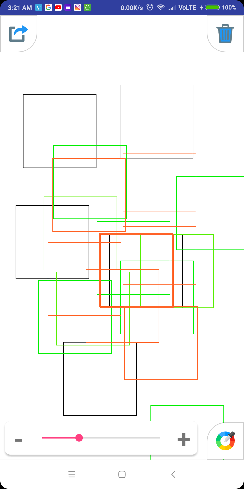
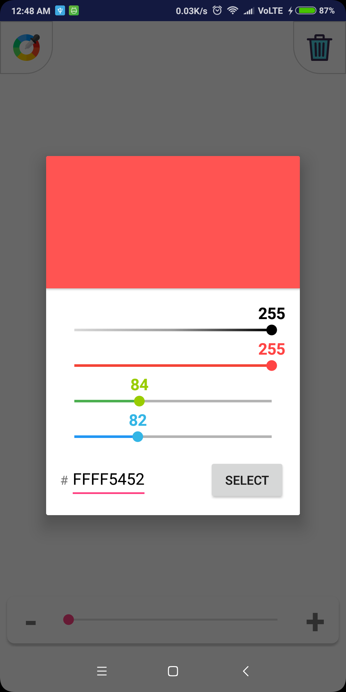
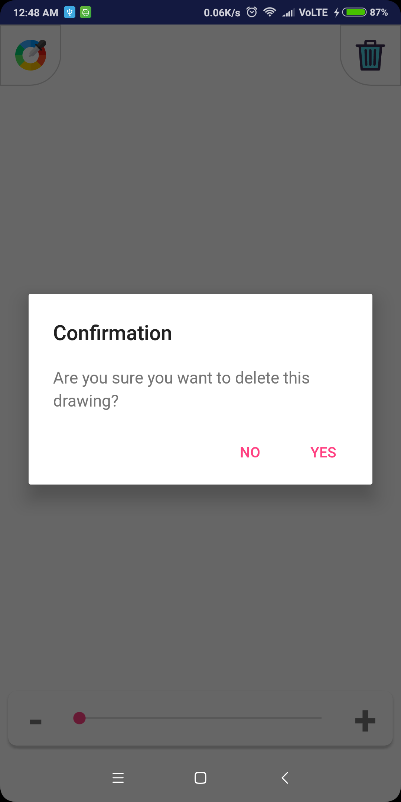

# SimpleDrawingApp
This is a simple drawing project where users are allowed to draw squares on the screen and adjusting the size of the squares with a slider.

## Screenshots :
Draw squares with different sizes               |  Change colors                                  |  Clear canvas
:----------------------------------------------:|:-----------------------------------------------:|:-----------------------------------------:
  |   | 
