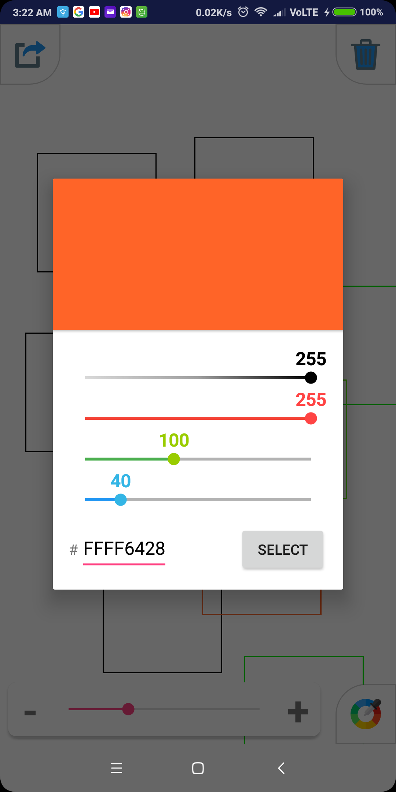

# SimpleDrawingApp
This is a simple drawing project where users are allowed to draw squares on the screen, adjust the size of the squares with a slider and export the coordinates fo the squares to a text file.

## Screenshots :
Draw squares with different sizes               |  Change colors                                  
:----------------------------------------------:|:-----------------------------------------------:
  |   

Clear canvas                                    |  Export coordinates         
:----------------------------------------------:|:----------------------------------------------:
  | 
